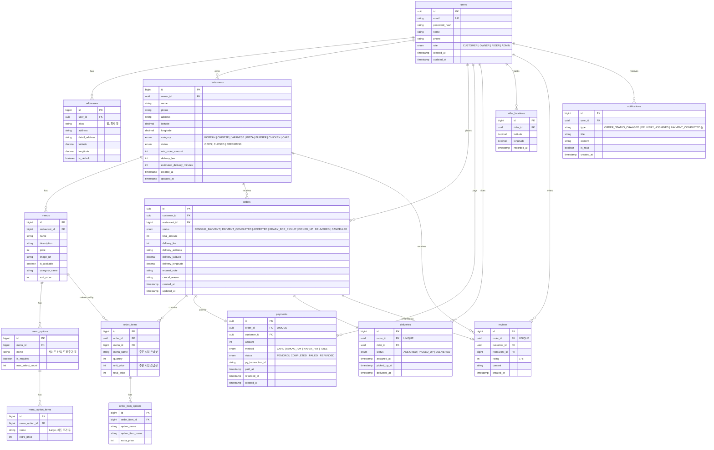

# 배달 플랫폼 설계 문서

## 주문 상태머신

```
[고객 주문]
    │
    ▼
PENDING_PAYMENT      ← 주문 생성, 결제 대기
    │ 결제 완료
    ▼
PAYMENT_COMPLETED    ← 결제 완료, 가게에 접수 요청
    │ 가게 수락
    ▼
ACCEPTED             ← 가게 접수, 조리 시작
    │ 조리 완료
    ▼
READY_FOR_PICKUP     ← 픽업 대기, 라이더 배정 시작
    │ 라이더 픽업
    ▼
PICKED_UP            ← 배달 중
    │ 배달 완료
    ▼
DELIVERED            ← 완료

취소 경로:
  PENDING_PAYMENT    → CANCELLED  (결제 실패 or 고객 취소)
  PAYMENT_COMPLETED  → CANCELLED  (가게 거절 → 자동 환불)
  ACCEPTED           → CANCELLED  (가게 취소 → 자동 환불)
```

---

## ERD



---

## 도메인 모듈 구조 (모놀리식 Phase 1)

```
delivery/
├── src/main/java/com/example/delivery/
│   ├── user/
│   │   ├── domain/
│   │   ├── repository/
│   │   ├── service/
│   │   └── controller/
│   ├── restaurant/
│   ├── order/
│   ├── payment/
│   ├── delivery/
│   └── notification/
```

---

## 진행 로드맵

| Phase | 내용 | 핵심 기술 |
|-------|------|-----------|
| 1 | 모놀리식 + 모듈화, 전체 도메인 구현 | Spring Boot, JPA, JWT |
| 2 | 스트레스 테스트 → 병목 시각화 | k6, OTel, Grafana |
| 3 | 병목 서비스 MSA 분리, 이벤트 기반 전환 | Kafka, Saga 패턴 |
| 4 | 실시간 배달 추적, 알림, 운영 완성 | WebSocket, SSE |
